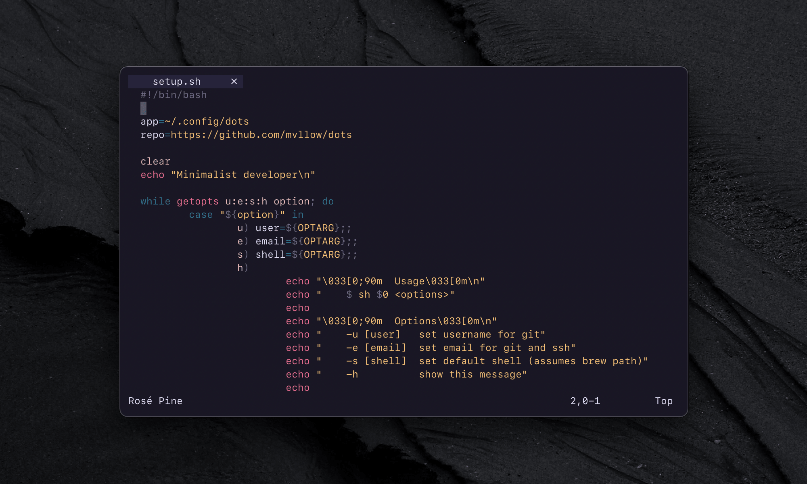
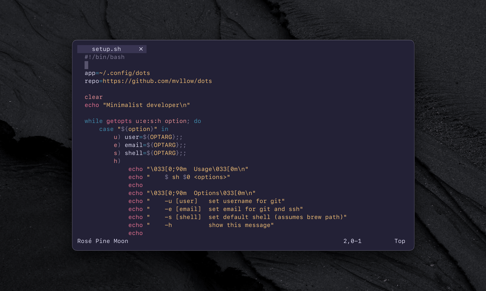
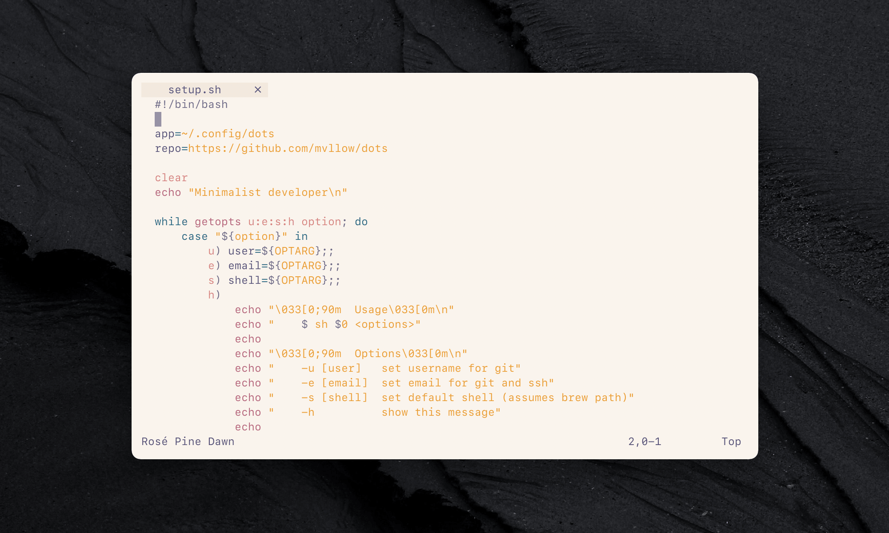

<p align="center">
    
    <h2 align="center">Rosé Pine for Neovim</h2>
</p>

<p align="center">All natural pine, faux fur and a bit of soho vibes for the classy minimalist</p>

<p align="center">
    <a href="https://github.com/rose-pine/rose-pine-theme">
        
    </a>
</p>

## Install

Install via your preferred package manager

```lua
-- Packer
use('rose-pine/neovim')
```

## Usage

Enable `rose-pine` colorscheme

```lua
vim.cmd('colorscheme rose-pine')
```

Optionally, enable [lualine](https://github.com/hoob3rt/lualine.nvim) theme

```lua
require('lualine').setup({
    options = {
        theme = 'rose-pine'
    }
})
```

Otherwise if you use [galaxyline](https://github.com/glepnir/galaxyline.nvim)

```lua
-- This should be in your galaxyline configuration file
local colors = require("galaxyline.themes.colors")["rose-pine"]
```

> **IMPORTANT**:
> 
> 1. This requires [NTBBloodbath's galaxyline fork](https://github.com/NTBBloodbath/galaxyline.nvim) in order to work.
> 
> 2. You can see the list of available colors [here](https://github.com/NTBBloodbath/galaxyline.nvim/blob/main/docs/themes.md#colors-standards).

## Plugin Support

- [Treesitter](https://github.com/nvim-treesitter/nvim-treesitter)
- [LSP diagnostics](https://neovim.io/doc/user/lsp.html)
- [Barbar](https://github.com/romgrk/barbar.nvim)
- [Gitsigns](https://github.com/lewis6991/gitsigns.nvim)
- [Modes](https://github.com/mvllow/modes.nvim)
- [NvimTree](https://github.com/kyazdani42/nvim-tree.lua)
- [WhichKey](https://github.com/folke/which-key.nvim)
- [Lualine](https://github.com/hoob3rt/lualine.nvim)
- [Indent-Blankline.nvim](https://github.com/lukas-reineke/indent-blankline.nvim)

## Gallery

**Rosé Pine**



**Rosé Pine Moon**



**Rosé Pine Dawn**



## Options

> Options should be set before colorscheme

```lua
-- Set variant
-- Defaults to 'dawn' if vim background is light
-- @usage 'base' | 'moon' | 'dawn' | 'rose-pine[-moon][-dawn]'
vim.g.rose_pine_variant = 'base'

-- Disable italics
vim.g.rose_pine_disable_italics = false

-- Use terminal background
vim.g.rose_pine_disable_background = false

-- Set colorscheme after options
vim.cmd('colorscheme rose-pine')
```

## Functions

```lua
-- Toggle between the three variants
require('rose-pine.functions').toggle_variant()

-- Toggle between base and dawn
require('rose-pine.functions').toggle_variant({'base', 'dawn'})

-- Switch to specified variant
require('rose-pine.functions').select_variant('moon')
```

## Keymaps

```lua
-- Toggle variant
vim.api.nvim_set_keymap('n', '<c-m>', [[<cmd>lua require('rose-pine.functions').toggle_variant()<cr>]], { noremap = true, silent = true })

-- Select each variant
vim.api.nvim_set_keymap('n', '<c-8>', [[<cmd>lua require('rose-pine.functions').select_variant('dawn')<cr>]], { noremap = true, silent = true })
vim.api.nvim_set_keymap('n', '<c-9>', [[<cmd>lua require('rose-pine.functions').select_variant('moon')<cr>]], { noremap = true, silent = true })
vim.api.nvim_set_keymap('n', '<c-0>', [[<cmd>lua require('rose-pine.functions').select_variant('base')<cr>]], { noremap = true, silent = true })
```
